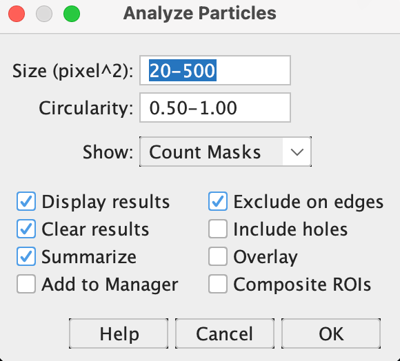
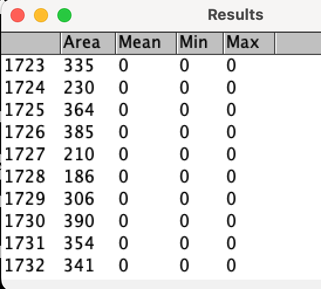

# Image processing and analysis
## Your assignment
Perform the following tasks and *edit this file* to show your results. Most images you will need are in the images in [image_files](image_files) directory.   

You can [download FIJI here](https://fiji.sc)  

### A great reference for this assignment is [Introduction to Bioimage Analysis](https://bioimagebook.github.io/index.html) by Pete Bankhead.  

#### *Task 1:*
Answer the following questions about the [Phase contrast](image_files/PhaseContrast.tif) and [Differential interference contrast](image_files/DifferentialInterference.tif) images:
Q1) What is the maximum intensity value in the [Differential interference contrast](image_files/DifferentialInterference.tif) file? 
A1) *254

Q2) What are the dimensions of the [Phase contrast](image_files/PhaseContrast.tif) file?  
A2) *(314, 226, 8-bit)  

Q3) Which image has greater dynamic range of pixel intensities? Phase or DiffInt?  
A3) *DiffInt has a greater dynamic range (219) compared to Phase (174) 

#### *Task 2:*
Open the file [Fluorescence_composite.tif](image_files/Fluorescence_composite.tif) and convert all the signal in the red channel to the blue channel, export the file as a JPG and upload it to this repository in the [image_files](image_files) directory with the name "Composite.jpg".  

The file should automatically show below when uploaded correctly and this file is viewed on GitHub.  
  

#### *Task 3:*  
Segment the nuclei in the [22946173.tif](image_files/22946173.tif) file and Analyze/Analyze Particles with size (pixel^2) 20–500, Circularity 0.5–1, and Show Count Masks as show in the image below. (Check "Display results", "Clear results", "Summarize", and "Exclude on edges".)  
  

The Results output should look like this:  
   
Save the results as "Results.csv" and upload into the same directory where this file is. It will be used in the Python notebook below.  

Also save the resultant "Count Mask" image file with the name "Count_Mask_22946173.tif" and upload into the [image_files](image_files) directory. (It should show up below once it is uploaded).  
  

Q4) How many particles were detected?  
A4) Put your answer here.  

You will do a first-pass assessment of the segmentation output by analyzing the size of the particles using Python...  

Open the [SizeAnalysis.ipynb](SizeAnalysis.ipynb) file and follow instructions in that file (you will be plotting a histogram of the sizes of the segmented objects and describing the output).  
